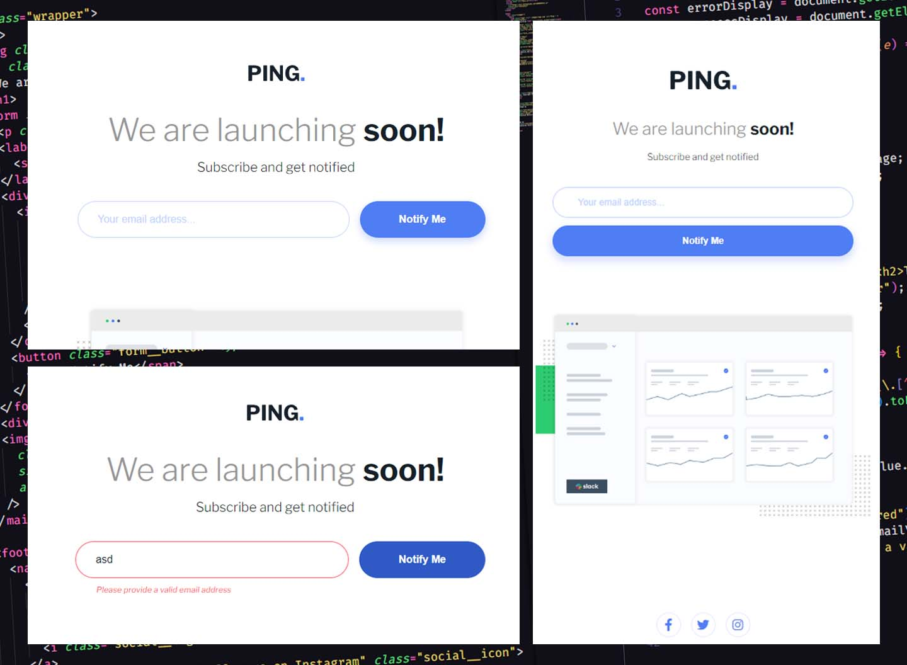

# Frontend Mentor - Ping coming soon page solution

This is a solution to the [Ping coming soon page challenge on Frontend Mentor](https://www.frontendmentor.io/challenges/ping-single-column-coming-soon-page-5cadd051fec04111f7b848da). Frontend Mentor challenges help you improve your coding skills by building realistic projects.

## Table of contents

- [Overview](#overview)
  - [The challenge](#the-challenge)
  - [Screenshot](#screenshot)
  - [Links](#links)
- [My process](#my-process)
  - [Built with](#built-with)
  - [What I learned](#what-i-learned)
  - [Continued development](#continued-development)
  - [Useful resources](#useful-resources)
- [Author](#author)

## Overview

### The challenge

Users should be able to:

- View the optimal layout for the site depending on their device's screen size
- See hover states for all interactive elements on the page
- Submit their email address using an `input` field
- Receive an error message when the `form` is submitted if:
  - The `input` field is empty. The message for this error should say _"Whoops! It looks like you forgot to add your email"_
  - The email address is not formatted correctly (i.e. a correct email address should have this structure: `name@host.tld`). The message for this error should say _"Please provide a valid email address"_

### Screenshot

### Links

- Solution URL: [Frontend Mentor](https://www.frontendmentor.io/solutions/responsive-coming-soon-page-with-email-subscription-form-xHfHe0GLir)
- Live Site URL: [Github Pages](https://leomcpena.github.io/ping-coming-soon/)

## My process

### Built with

- Semantic HTML5 markup
- CSS custom properties
- Mobile-first workflow
- Accessibility
- JavaScript

### What I learned

This challenge is the first on a roadmap to improve my JS skills. It was great to work with a simple form and get more confidence in my capabilities. I had the chance to do some client-side validation and reinforce form accessibility.

### Continued development

I am unsure about the script validation or if I am using the best practices. I disabled browser validation with the "novalidate" attribute to see how my validation was working. The browser validation and tooltip were over my validation.

I'm looking forward to doing more JS challenges to improve my skills.

### Useful resources

- [MDN Web Docs](https://developer.mozilla.org/en-US/docs/Learn/Forms/Form_validation) - This helped me with the client-side validation.

## Author

- Website - [Leonardo Pena](https://www.leopena.com)
- Frontend Mentor - [@leomcpena](https://www.frontendmentor.io/profile/yourusername)

